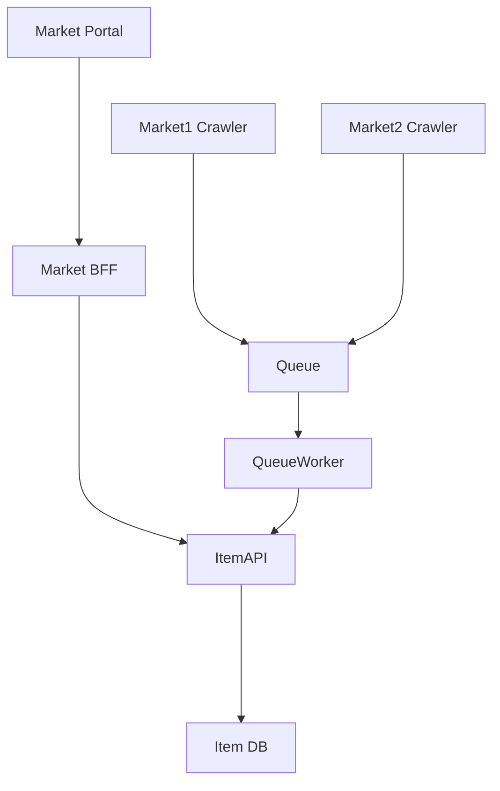

# MarketScrapperAPI.github.io

MarketScrapper Site

- [MarketScrapperAPI.github.io](#marketscrapperapigithubio)
  - [What is MarketScrapper](#what-is-marketscrapper)
  - [Architecture](#architecture)
    - [Components](#components)

## What is MarketScrapper

MarketScrapper is a predefined set of web crawlers/scrappers that collect article information form specific market websites.
This information is formated and published from the crawlers into a queue, that is then consumed by a worker that populates a Item Service.

## Architecture

### Components

| Component       | Description                                                                               |
| --------------- | ----------------------------------------------------------------------------------------- |
| Market Portal   | The portal that will display the items                                                    |
| Market BFF      | The BFF that will be used by the portal to get the items                                  |
| ItemAPI         | The API that will be used by the BFF to get the items                                     |
| Market1 Crawler | The crawler that will get the items from Market1                                          |
| Market2 Crawler | The crawler that will get the items from Market2                                          |
| Queue           | The queue that will be used to store the items                                            |
| QueueWorker     | The worker that will be used to consume the items from the queue and populate the ItemAPI |
| Item DB         | The database that will be used to store the items                                         |
